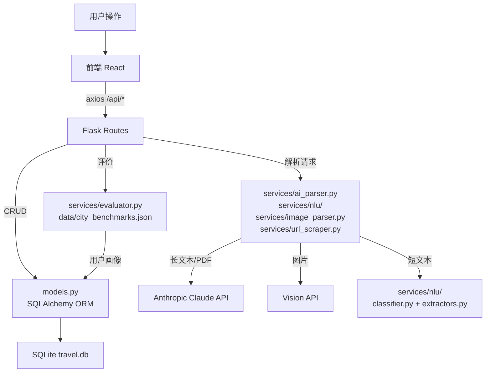
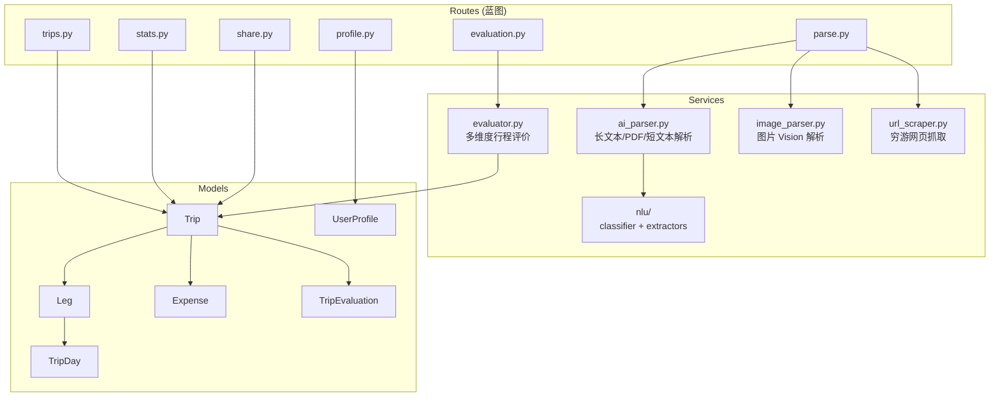

# ARCHITECTURE.md — 系统架构

Soul's Travel 的系统骨架：服务划分、数据流、模块关系、技术栈总览、文件地图。

---

## 技术栈总览

| 层 | 技术 | 版本 |
|----|------|------|
| 前端框架 | React | 19 |
| 前端构建 | Vite | 8 |
| UI 组件库 | Ant Design | 6 |
| 图表 | Recharts | — |
| 路由 | React Router | 7 |
| HTTP 客户端 | Axios | — |
| 后端框架 | Flask + Flask-CORS | 3.1 |
| ORM | SQLAlchemy | 2.0 |
| 数据库 | SQLite | 单文件 |
| PDF 解析 | pdfplumber | 0.11 |
| AI 解析 | Anthropic Claude API | claude-sonnet-4-20250514 |
| 图片解析 | OpenAI 兼容 Vision API | — |
| NLU 意图分类 | jieba + scikit-learn | LinearSVC |
| 网页抓取 | Playwright | ≥1.40 |
| 测试 | pytest | 8.3 |

---

## 服务划分

```
┌─────────────────────────────────────┐
│           前端（Vite :5000）         │
│  pages/ + components/ + services/   │
└──────────────┬──────────────────────┘
               │ /api/* (proxy)
┌──────────────▼──────────────────────┐
│           后端（Flask :5002）        │
│  routes/ → services/ → models/      │
└──────────────┬──────────────────────┘
               │ SQLAlchemy
┌──────────────▼──────────────────────┐
│        数据库（SQLite）              │
│  travel.db（单文件，backend/目录）   │
└─────────────────────────────────────┘
```

### 外部服务

| 服务 | 用途 | 触发路径 |
|------|------|----------|
| Anthropic Claude API | 长文本/PDF 结构化解析 | `POST /api/parse` |
| OpenAI 兼容 Vision API | 图片行程解析 | `POST /api/parse`（图片文件） |
| 穷游（qyer.com） | 网页抓取 | `POST /api/parse/url` |

---

## 完整数据流



---

## 后端模块关系



---

## 后端文件地图

### `backend/routes/`

| 文件 | Blueprint | 职责 |
|------|-----------|------|
| `trips.py` | `trips_bp` | Trip CRUD、Leg/TripDay/Expense 嵌套写入、软删除、行程日活动 PATCH |
| `stats.py` | `stats_bp` | 统计聚合：概览、目的地排名、开销分析 |
| `share.py` | `share_bp` | 生成/撤销分享 token、公开行程读取 |
| `parse.py` | `parse_bp` | 接收文件/文本/URL，分发到对应解析服务 |
| `evaluation.py` | `evaluation_bp` | 获取/刷新行程评价（本地规则评分，带缓存） |
| `profile.py` | `profile_bp` | 用户画像读写（收入层级、年旅行预算、家庭描述） |

### `backend/services/`

| 文件 | 职责 |
|------|------|
| `ai_parser.py` | 核心解析引擎：长文本规则解析（城市/活动/费用）+ 短文本 NLU 路由；穷游 m 站文本解析 |
| `evaluator.py` | 本地规则评价：读 `city_benchmarks.json` + 用户画像 + 季节因子 → 花费/节奏/住宿/交通/景点评分 |

> **评分阈值惯例**：`_evaluate_city` 中城市景点标签阈值为 `>= 80% → 景点全面` / `< 80% → 景点覆盖不足`，两段互补无死区。修改阈值时需保证 `if >= A / elif < A` 的上下界一致。评价数据缓存在 `TripEvaluation.evaluation_data`，改动评分逻辑后需对所有行程执行 `POST /api/trips/<id>/evaluation` 重新生成。
| `image_parser.py` | OpenAI 兼容 Vision API 解析图片 → 与解析管道兼容的 JSON 结构 |
| `url_scraper.py` | Playwright 移动 UA 抓取穷游 `plan.qyer.com` 页面文本 |
| `nlu/classifier.py` | jieba 分词 + TF-IDF + LinearSVC 意图分类，`model.pkl` 缓存 |
| `nlu/extractors.py` | 按意图抽取结构化槽位（改类别、加费用、设住宿、改活动名等） |
| `nlu/train.py` | 训练并保存 `model.pkl` |
| `nlu/training_data.yml` | NLU 训练数据 |

### `backend/` 根目录

| 文件 | 职责 |
|------|------|
| `app.py` | Flask 工厂：注册蓝图、CORS、`/api/health`、启动端口 5002 |
| `database.py` | SQLAlchemy engine + Session + `init_db()` |
| `models.py` | ORM 模型（见数据模型章节） |
| `seed.py` | 导入 `data/samples/201910-myanmar.json` 样例数据 |
| `data/city_benchmarks.json` | 城市消费基准价格表，供 evaluator 使用 |

---

## 前端文件地图

### `frontend/src/pages/`

| 文件 | 路由 | 职责 |
|------|------|------|
| `Home.jsx` | `/` | 统计数字卡片 + 最近行程列表 |
| `TripList.jsx` | `/trips` | 行程列表、筛选/搜索、个人背景抽屉 |
| `TripDetail.jsx` | `/trips/:id` | 行程详情：Leg 分块 + 日时间轴 + 开销侧栏 + 评价 |
| `TripEditor.jsx` | `/trips/new` `/trips/:id/edit` | 左聊天+右表单分屏，AI 解析 → 表单填充 |
| `Timeline.jsx` | `/timeline` | 按年分组的垂直时间轴 |
| `Stats.jsx` | `/stats` | 概览统计 + Recharts 图表 |
| `ShareView.jsx` | `/share/:token` | 公开只读，无侧边栏 Layout |

### `frontend/src/components/`

| 文件 | 职责 |
|------|------|
| `Layout.jsx` | 72px 图标侧边栏 + 主内容区 |
| `TripCard.jsx` | 柔和渐变色横排行程卡片 |
| `ChatPanel.jsx` | AI 对话面板：文本输入 / 文件上传 / 穷游 URL 解析 |
| `TripForm.jsx` | 结构化行程表单，含 dirty flag 防 AI 覆盖 |
| `ExpenseTable.jsx` | 开销总览：类别条形图 + 合计 + 人均/日均 |
| `TripEvaluation.jsx` | 行程评价 UI：维度卡片 + 评分 + 建议 |
| `StatsChart.jsx` | Recharts 图表集：CategoryPie / TripExpenseBar / PerDayTrend / DestinationRank |
| `TimelineNode.jsx` | 时间线中单次行程节点 |
| `ProfileDrawer.jsx` | 侧拉抽屉：用户画像编辑 + 已访问国家/城市 |

### `frontend/src/services/`

| 文件 | 职责 |
|------|------|
| `api.js` | Axios 实例封装：tripApi / statsApi / shareApi / evaluationApi / profileApi / tripDayApi / parseApi |

---

## 数据模型关系

```
Trip 1──* Leg 1──* TripDay
Trip 1──* Expense
Leg  1──* Expense（可选）
TripDay 1──* Expense（可选）
Trip 1──1 TripEvaluation（可选，懒生成+缓存）
UserProfile（单例，无 Trip 关联）
```

完整 schema 见 [TECHNICAL.md](TECHNICAL.md)。

---

## 项目目录结构

```
soul's travel/
├── backend/
│   ├── app.py                    # Flask 入口，端口 5002
│   ├── database.py               # SQLite + SQLAlchemy
│   ├── models.py                 # ORM 模型
│   ├── seed.py                   # 样例数据导入
│   ├── data/
│   │   └── city_benchmarks.json  # 城市消费基准
│   ├── routes/
│   │   ├── trips.py
│   │   ├── stats.py
│   │   ├── share.py
│   │   ├── parse.py
│   │   ├── evaluation.py
│   │   └── profile.py
│   ├── services/
│   │   ├── ai_parser.py
│   │   ├── evaluator.py
│   │   ├── image_parser.py
│   │   ├── url_scraper.py
│   │   └── nlu/
│   │       ├── classifier.py
│   │       ├── extractors.py
│   │       ├── train.py
│   │       ├── training_data.yml
│   │       └── model.pkl
│   ├── tests/
│   │   ├── conftest.py
│   │   ├── test_models.py
│   │   ├── test_trips.py
│   │   ├── test_stats.py
│   │   ├── test_share.py
│   │   ├── test_parser_japan.py
│   │   ├── test_parser_korea.py
│   │   └── test_parser_multi_pdf.py
│   └── requirements.txt
├── frontend/
│   ├── src/
│   │   ├── App.jsx
│   │   ├── main.jsx
│   │   ├── pages/
│   │   │   ├── Home.jsx / Home.css
│   │   │   ├── TripList.jsx / TripList.css
│   │   │   ├── TripDetail.jsx
│   │   │   ├── TripEditor.jsx
│   │   │   ├── Timeline.jsx
│   │   │   ├── Stats.jsx / Stats.css
│   │   │   └── ShareView.jsx
│   │   ├── components/
│   │   │   ├── Layout.jsx / Layout.css
│   │   │   ├── TripCard.jsx / TripCard.css
│   │   │   ├── ChatPanel.jsx / ChatPanel.css
│   │   │   ├── TripForm.jsx / TripForm.css
│   │   │   ├── ExpenseTable.jsx / ExpenseTable.css
│   │   │   ├── TripEvaluation.jsx / TripEvaluation.css
│   │   │   ├── StatsChart.jsx
│   │   │   ├── TimelineNode.jsx
│   │   │   └── ProfileDrawer.jsx / ProfileDrawer.css
│   │   └── services/
│   │       └── api.js
│   ├── package.json
│   ├── vite.config.js            # proxy /api → :5002, port 5000
│   └── eslint.config.js
├── CLAUDE.md                     # 项目说明书 / AI 编码守则
├── ARCHITECTURE.md               # 系统架构（本文档）
├── DESIGN.md                     # 页面设计与交互规范
├── TECHNICAL.md                  # 技术文档（接口/测试/运维）
├── README.md                     # 快速开始
├── start.sh                      # 一键启动脚本
└── 启动 Soul's Travel.command    # macOS 双击启动
```
